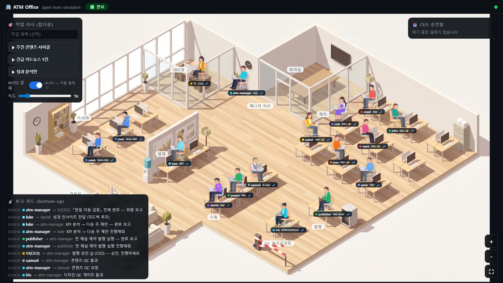

# ATM Office — 에이전트 팀 오피스 시뮬레이션



`.claude/agents/`의 ATM 콘텐츠 팀(CEO YJ + 매니저 + 15 에이전트)을 미니어처 오피스에서 시각화한다.
과제를 주면 유관 캐릭터들이 지시받고(탑다운) → 책상에서 일하고 → 매니저/CEO에게 보고(바텀업)하며,
실행 전 **CEO 승인 게이트**(또는 AUTO 자동결재)를 거친다. Phase 1 = 데모 시뮬레이션(실제 실행 연동은 Phase 2).

## 실행

```
cd atm-office
npm start          # 의존성 없음 — Node 내장만 사용
→ http://localhost:3777     (?debug=1 : 앵커 오버레이)
```

## 사용법
- **작업 지시(좌상):** 프리셋 3종(주간 콘텐츠 사이클 / 긴급 카드뉴스 / 성과 분석만) + 속도(0.5~4x) + AUTO 결재 토글
- **CEO 승인함(우상):** 게이트 도달 시 결재 카드 — 승인/반려(+사유). AUTO ON이면 자동 통과
- **에이전트 클릭:** 역할·모델·권한·도구·업무범위·산출물 (`.claude/agents/*.md` 프론트매터 미러 — `server/sim/roster.js`)
- **보고 피드(좌하):** 지시·보고·QC 판정·결재 이력 실시간

파이프라인 정의: `server/sim/pipeline.js` (리서치∥ → 인사이트 → 기획 → [승인①] → 이미지 선행 → 제작 5채널∥ → iris 게이트 → samuel QC → [승인②] → 발행 → 성과 → 피드백 루프)

## 이벤트 스키마 (Phase-2 계약 — 절대 안 깨기)

서버가 유일한 진실(`engine.dispatch`). SSE `/api/events`로 브로드캐스트, 연결 시 항상 `snapshot` 선송신.

```json
{ "v":1, "seq":42, "ts":1751600000000, "source":"demo|real", "type":"...", ... }
```

| type | 주요 필드 | 의미 |
|---|---|---|
| `snapshot` | world | 재연결 복원용 전체 상태 |
| `task_created` / `task_state` | taskId, title / state, stage | 태스크 라이프사이클 (`queued→awaiting_approval→running→done\|rejected\|failed`) |
| `agent_state` | agent, state(idle\|walking\|working\|reporting\|waiting_gate\|blocked), detail | 캐릭터 상태 |
| `agent_move` | agent, from, to (시맨틱 앵커 `desk:caleb` / `anchor:manager_q`) | 이동 — 좌표는 클라 `anchors.js`가 해석 |
| `message` | from, to, kind(command\|report\|handoff), text | 지시/보고 피드+말풍선 |
| `approval_request` / `approval_result` | gateId, summary / decision, by, note | CEO 결재 |
| `gate_qc` | gate(iris\|samuel), verdict(pass\|fail), note | QC 게이트(차단바 연출) |
| `artifact` | agent, path | 산출물 경로(인스펙터) |

**API**
- `POST /api/cmd` — `{cmd: start_task|approve|set_auto|set_speed, ...}`
- `POST /api/ingest` — 위 스키마 그대로 외부 주입(`source:"real"`). 로스터/타입 검증 후 dispatch.
  ```
  curl -X POST localhost:3777/api/ingest -H "Content-Type: application/json" \
    -d '{"v":1,"type":"agent_state","agent":"caleb","state":"working","detail":"실제 실행"}'
  ```

## Phase 2 (설계 확정, 미구현)
훅 관찰자 방식: `.claude/settings.json`에 SubagentStart/Stop·PostToolUse 훅 → `tools/emit.js`(훅 JSON → `POST /api/ingest`, 서버 다운 시 무시 — 운영 파이프라인 무영향). `server/sim/adapter.js`가 roster 매칭·이벤트 번역. 헤드리스 스폰 오케스트레이터는 채택 안 함(atm-manager 로직 중복·운영 경로 이원화).

## 에셋
`public/assets/sprites/{id}_idle.png · {id}_sit.png`(치비 5:5, nanobanana 생성+누끼) + `assets/office_bg.png`.
**스프라이트가 없으면 CSS 폴백 치비로 자동 렌더** — 에셋 없이도 완전 동작.
